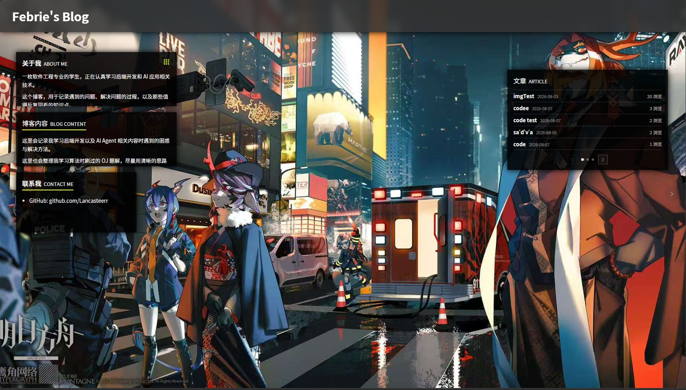
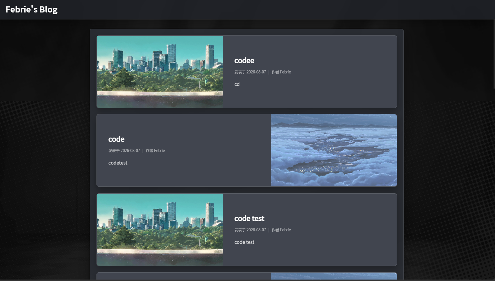
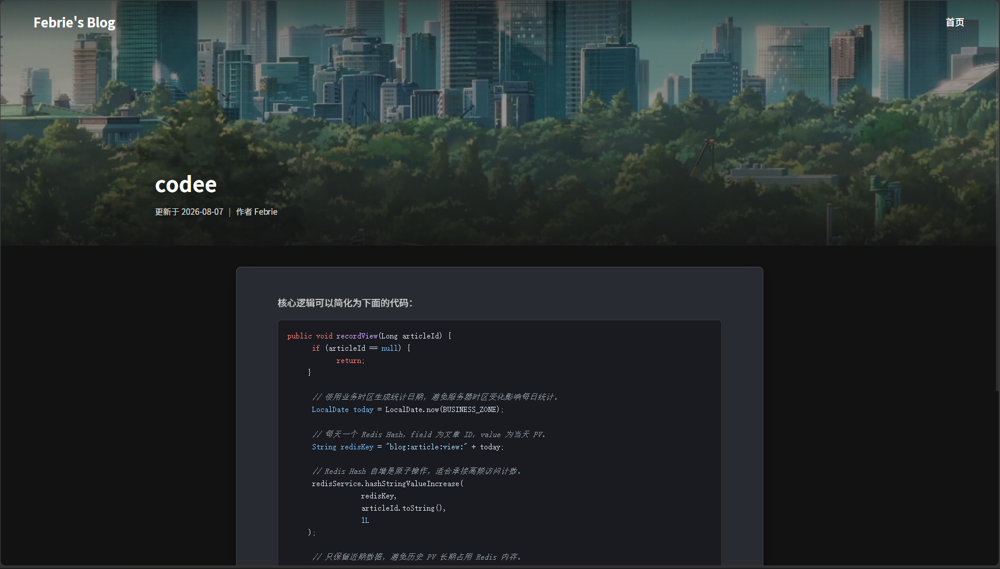
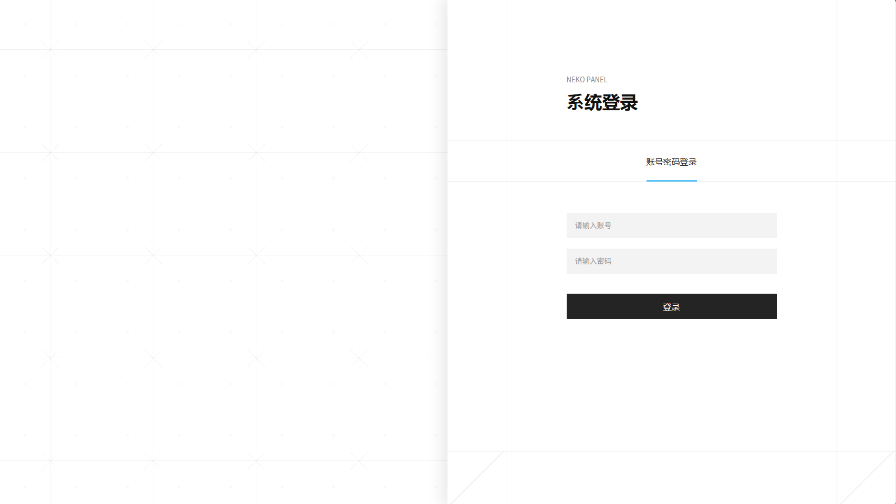
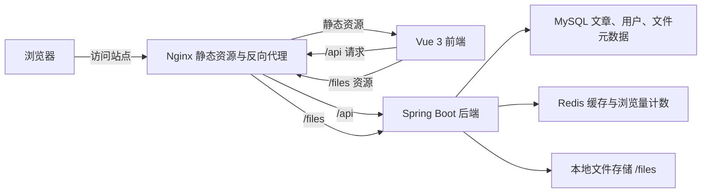

# Easy Blog Full

<div align="center">

一个基于 **Vue 3 + Spring Boot 3.5** 的前后端分离个人博客系统，包含访客浏览、文章管理、富文本编辑、图片上传、Redis 缓存、浏览量统计和 Docker 部署能力。


</div>

## 目录

- [项目简介](#项目简介)
- [功能特性](#功能特性)
- [项目展示](#项目展示)
- [技术栈](#技术栈)
- [快速开始](#快速开始)
- [生产部署](#生产部署)
- [项目结构](#项目结构)
- [接口与配置约定](#接口与配置约定)
- [可改进点](#可改进点)
- [License](#license)

## 项目简介

Easy Blog Full 是一个用于课程作业、个人博客和二次开发练习的博客系统。仓库中同时包含前端 `blog_front` 和后端 `demo_bk`，前端负责页面展示与后台编辑体验，后端负责认证、文章、文件、缓存、统计和持久化。

项目当前更偏向“个人学习型博客系统”，代码里已经加入了一些面向生产环境的改进，例如 JWT 鉴权、CORS 白名单、Nginx 同源反代、Redis 缓存、PV 定时刷库和 Docker Compose 部署。

## 功能特性

| 模块 | 功能 | 说明 |
| --- | --- | --- |
| 访客前台 | 首页信息卡片 | 展示关于我、博客内容、联系方式和最近文章入口 |
| 访客前台 | 文章列表 | 支持分页浏览文章，列表数据由后端接口提供 |
| 访客前台 | 文章详情 | 支持文章封面、正文内容、代码高亮和基础元信息展示 |
| 访客前台 | 热门排序 | 后端支持按浏览量倒序查询文章列表 |
| 管理后台 | 登录鉴权 | 使用 Spring Security + JWT 保护 `/api/admin/**` 接口 |
| 管理后台 | 文章管理 | 支持文章新增、编辑和删除 |
| 管理后台 | 富文本编辑 | 使用 Tiptap 编辑文章内容，并保存 HTML 与 JSON 内容 |
| 管理后台 | 图片上传 | 管理端上传图片，后端保存文件元数据和本地文件 |
| 后端服务 | Redis 缓存 | 缓存文章详情和文章分页结果，减少数据库查询压力 |
| 后端服务 | 浏览量统计 | 文章访问先写 Redis，再由定时任务刷入 MySQL |
| 后端服务 | 操作日志 | 通过 AOP 记录关键后台操作，并定时清理过期日志 |
| 部署运维 | Docker Compose | 支持本地依赖启动和生产环境一键拉取镜像部署 |
| 部署运维 | Nginx 反代 | 前端容器同源代理 `/api` 和 `/files`，降低跨域和资源域名问题 |

## 项目展示

以下截图来自本地 `http://localhost:8080/`。后台管理页需要有效账号登录，当前 README 先展示登录页；管理首页和编辑页截图可在补充账号或演示数据后继续追加。

### 首页



### 文章列表



### 文章详情



### 后台登录



## 技术栈

| 层级 | 技术 |
| --- | --- |
| 前端框架 | Vue 3、Vue Router 4、Vite |
| UI 与编辑器 | Element Plus、Tiptap、highlight.js、DOMPurify |
| 网络请求 | Axios，默认通过 `/api` 访问后端 |
| 后端框架 | Java 17、Spring Boot 3.5、Spring Security、Spring AOP |
| 数据访问 | MyBatis Plus、MySQL 8 |
| 缓存与统计 | Redis 7、定时任务 |
| 构建部署 | Maven、npm、Docker、Docker Compose、Nginx、GitHub Actions、GHCR |

## 快速开始

### 1. 启动本地依赖

本地开发推荐先启动 MySQL 和 Redis。环境变量示例文件已经放在后端目录中，复制后按需修改即可。

```bash
cd demo_bk
cp .env.dev.example .env.dev
docker compose --env-file .env.dev -f docker-compose.dev.yml up -d
```

### 2. 启动后端

后端默认监听 `5090` 端口。使用 Maven 或 IDEA 启动前，可以把开发环境变量复制成 `.env`，Spring Boot 会自动导入。

```bash
cd demo_bk
cp .env.dev .env
mvn spring-boot:run
```

也可以只打包运行：

```bash
cd demo_bk
mvn clean package
java -jar target/blog-backend.jar
```

### 3. 启动前端

前端开发服务固定在 `http://127.0.0.1:8080/`，Vite 会把 `/api` 代理到后端 `http://localhost:5090`。

```bash
cd blog_front
npm install
npm run dev
```

浏览器访问：

```text
http://127.0.0.1:8080/
```

## 生产部署

生产部署配置位于 `demo_bk/docker-compose.prod.pull.yml`，默认拉取 GitHub Actions 构建并推送到 GHCR 的前后端镜像。

```bash
cd demo_bk
cp .env.prod.example .env.prod
docker compose --env-file .env.prod -f docker-compose.prod.pull.yml pull
docker compose --env-file .env.prod -f docker-compose.prod.pull.yml up -d
```

生产环境建议：

- `.env.prod` 只保存在服务器，不提交到仓库。
- `BLOG_CORS_ALLOWED_ORIGINS` 配置为真实前端域名。
- `BLOG_JWT_SECRET` 使用高强度随机值。
- `BLOG_STORAGE_ROOT` 对应的上传文件目录需要持久化和备份。
- HTTPS 推荐交给宿主机网关、Caddy、Nginx 或云厂商证书层处理。

## 项目结构

```text
Easy_blog_full
├─ .github/workflows
│  └─ docker-images.yml          # 构建并推送前后端 Docker 镜像
├─ blog_front                    # Vue 3 + Vite 前端
│  ├─ src
│  │  ├─ api                     # 前端接口封装
│  │  ├─ components              # 页面与通用组件
│  │  ├─ router                  # 前端路由
│  │  └─ utils                   # 请求、滚动、代码高亮等工具
│  ├─ nginx/default.conf         # 生产前端 Nginx 配置
│  └─ package.json
├─ demo_bk                       # Spring Boot 后端
│  ├─ sql/white_jotter.sql       # 数据库初始化 SQL
│  ├─ src/main/java/com/febrie/demo_bk
│  │  ├─ controller              # REST API
│  │  ├─ service                 # 业务逻辑
│  │  ├─ dao                     # MyBatis Plus 数据访问
│  │  ├─ config                  # Security、Redis、MVC 等配置
│  │  ├─ filter                  # JWT 认证过滤器
│  │  ├─ task                    # 定时任务
│  │  └─ result                  # 统一响应结构
│  ├─ docker-compose.dev.yml     # 本地 MySQL 和 Redis
│  ├─ docker-compose.prod.pull.yml
│  ├─ .env.dev.example
│  ├─ .env.prod.example
│  └─ pom.xml
└─ docs/screenshots              # README 展示截图
```

## 系统架构



## 接口与配置约定

| 项目 | 默认值或约定 |
| --- | --- |
| 前端开发地址 | `http://127.0.0.1:8080/` |
| 后端默认端口 | `5090` |
| 前端 API 前缀 | `/api` |
| 公开接口 | `/api/public/**` |
| 管理接口 | `/api/admin/**` |
| 静态文件访问 | `/files/**` |
| 本地配置示例 | `demo_bk/.env.dev.example` |
| 生产配置示例 | `demo_bk/.env.prod.example` |

常用接口示例：

| 方法 | 路径 | 说明 |
| --- | --- | --- |
| `POST` | `/api/public/login` | 登录并返回 JWT |
| `POST` | `/api/admin/logout` | 注销当前 JWT |
| `GET` | `/api/public/get_article_list` | 分页获取文章列表 |
| `GET` | `/api/public/article?id={id}` | 获取文章详情 |
| `POST` | `/api/admin/content/article` | 新增或修改文章 |
| `DELETE` | `/api/admin/content/delarticle/{id}` | 删除文章 |
| `POST` | `/api/admin/files/upload` | 上传文章图片 |

## TODO List

- 补充 Swagger 或 OpenAPI 文档，方便前后端联调和接口测试。
- 为登录、文章分页、文章保存、文件上传和 PV 刷库增加更系统的自动化测试。
- 当前注册页在前端路由中已关闭，在 README 或后台初始化脚本中明确管理员账号创建方式。
- 文件上传已经限制大小，继续补充更严格的文件扩展名、图片内容校验和异常提示。
- 生产环境建议补充数据库备份、日志采集、监控告警和镜像回滚流程。
- 搜索 / tag功能
- 评论功能

## 相关文档

- [前端说明](blog_front/README.md)
- [后端说明](demo_bk/README.md)
